# Completely Fairly Scheduled Todo (CFS Todo)

## Summary

This program is a todo app intended to help reduce decision paralysis in people with ADHD like me (danybeam).
As of version 0.1.0 it's designed to work with my brain but I do intend to add a configuration screen to be able to tweak values so more people can use it.  
It is important to note that it's not meant to completely replace other project management tools like Asana, Jira, etc. but to complement them.

# Table of Contents

- [Completely Fairly Scheduled Todo (CFS Todo)](#completely-fairly-scheduled-todo-cfs-todo)
  - [Summary](#summary)
- [Table of Contents](#table-of-contents)
- [How to install](#how-to-install)
  - [Windows](#windows)
  - [Not Windows](#not-windows)
- [Instruction Manual](#instruction-manual)
  - [How does this work?](#how-does-this-work)
  - [Tasks](#tasks)
    - [Create a Task](#create-a-task)
    - [Complete and Un-Complete a task](#complete-and-un-complete-a-task)
    - [Rotate a task](#rotate-a-task)
    - [Suspend a task](#suspend-a-task)
    - [See a task detailed info](#see-a-task-detailed-info)
    - [Edit a task](#edit-a-task)
    - [Delete a task](#delete-a-task)
  - [Workspaces](#workspaces)
    - [Create a workspace](#create-a-workspace)
      - [Important rule concepts](#important-rule-concepts)
    - [Open a workspace](#open-a-workspace)
    - [Delete a workspace](#delete-a-workspace)
  - [Saving](#saving)
- [Technical Stuff](#technical-stuff)
- [Known Issues](#known-issues)
- [Roadmap](#roadmap)
- [License](#license)

# How to install
## Windows
- Go to the lates release on this repo
- Download the MSI
- Run the MSI
- That's it... kinda

> [!Important]  
> You might get a warning window saying that this program might be unsafe. Unfortunately I haven't gotten the certificates to sign the installers so, click on "More info" then "Run anyway".  
> I made this app open source so anyone can check the code and confirm nothing nefarious is going on.
> I might get a certificate to sign the installers one day but I cannot promise it will be soon.

This app auto-updates so you'll get the latest version whenever you open the app.

## Not Windows

As of version 0.1.0 we do not produce non-windows builds.
I (danybeam) definitely need help with MacOS since I don't have a Mac, but with Linux I just need to see some interest before I jump into it.
If you use Linux I'm sure you know how to make your own build, any teachings and contributions are more than welcomed :\)

# Instruction Manual
## How does this work?

As you work on tasks, this app takes three (but actually four) things into account
1. How much do you have to do (your task list or the tasks in your current [workspace](#workspaces))
2. How important is for the current task to get done (the current task's priority)
3. How much time you have to work (your "available hours")
   1. In this version "available hours" is 35hrs but it will be configurable in the future.

Tasks with a higher priority will bubble up to the top faster and you'll be assigned more hours to do them. i.e. You'll get a bigger time _slice_ to work on them.

Example 1:  
You only have one task, therefore you get all your available hours to work on them.
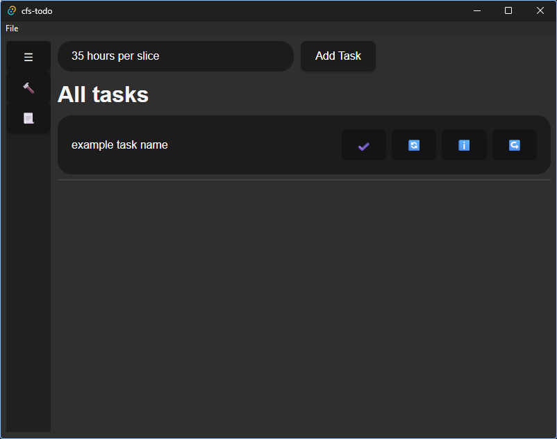  
*Time slice showing all available hours as one big slice*

Example 2:  
You have two tasks with the same priority, therefore they get the same ammount of time.
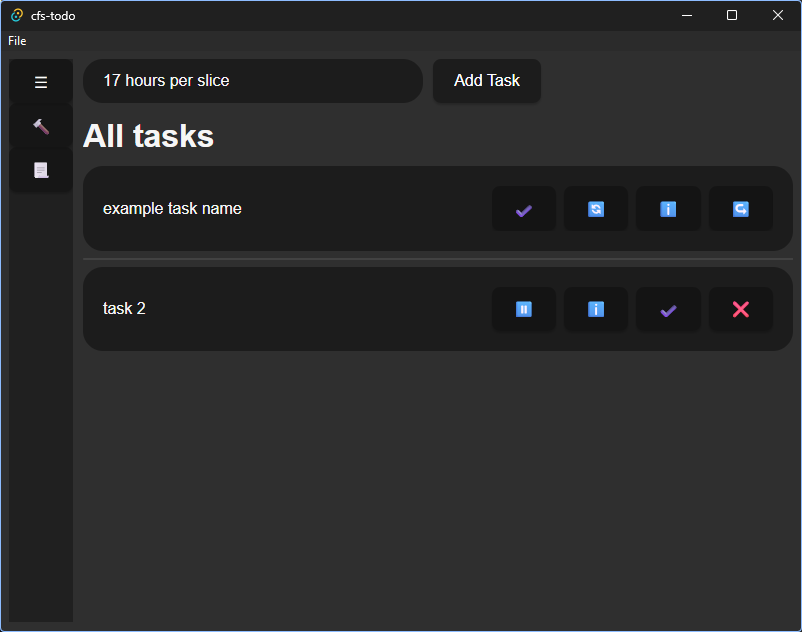  
*Time slice of the first task*
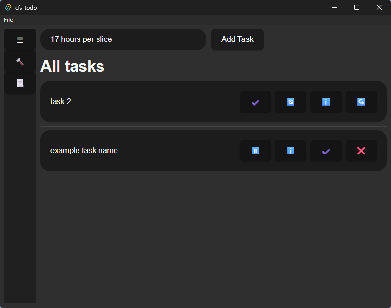  
*Time slice of the second task.  
Notice how the time slice didn't change*

Example 3:  
You have a third task of much higher priority, therefore it gets a bigger time slice.  
For reference the two task on the bottom are priority 20 (the default) and this new task is priority 1.
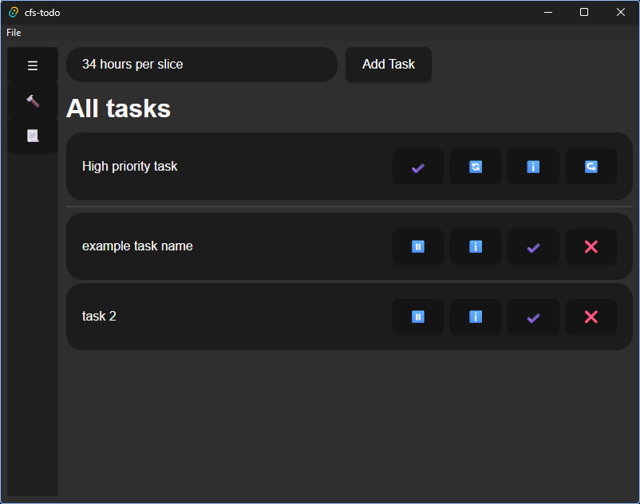  
*Example of high priority task taking a bigger time slice*

The last thing it considers is your "minimum slice time", which is the minimal ammount of time that you feel you need to do *something*™️.  
If you have too many tasks and it would be scheduled a time slice smaller than your minimum slice time, the minimum will be forced and you'll be told that you are overburdened. This is intentional to help with mindfulness and to identify if you have too much on your plate.  

This will also be configurable in the future but it is set as 4hrs in this version.
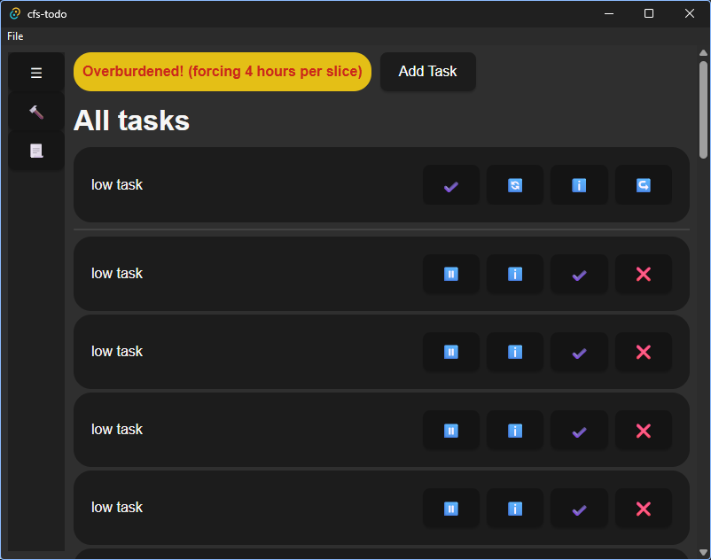  
*Overburdened scenario with warning on top*

> [!warning]
> In this version you'll only be told you're overburdened once a task cannot schedule the right ammount of time.  
> In the future we intend to check for overburden and give an earlier warning so you can identify it earlier.

## Tasks
### Create a Task

1. Click on "Add Task"
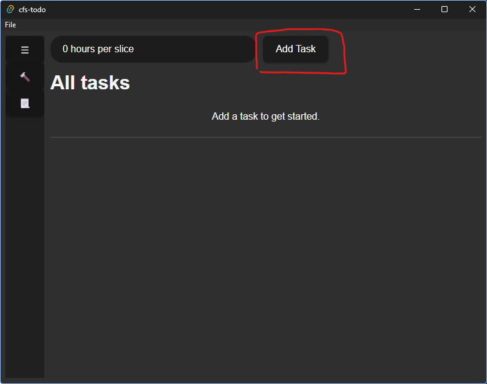  
*Add task button*

2. Fill out the Task form
   1. The task name is the only mandatory parameter, the rest are optional
   2. Tags support any letter from a to z case insensitive, any number, and the characters _ - and /
3. To add a tag, fill the text box on the bottom and press "Add Tag"
   1. Tags are optional and you can add as many tags as you want
   2. To remove a tag press on the X next to it
4. Once you're done press "Add Task". It should show up in the "All task view"

>[!note]
> For priorities, a lower number means a higher priority.  
> In this version priorities go from 1 to 40 (both inclusive)

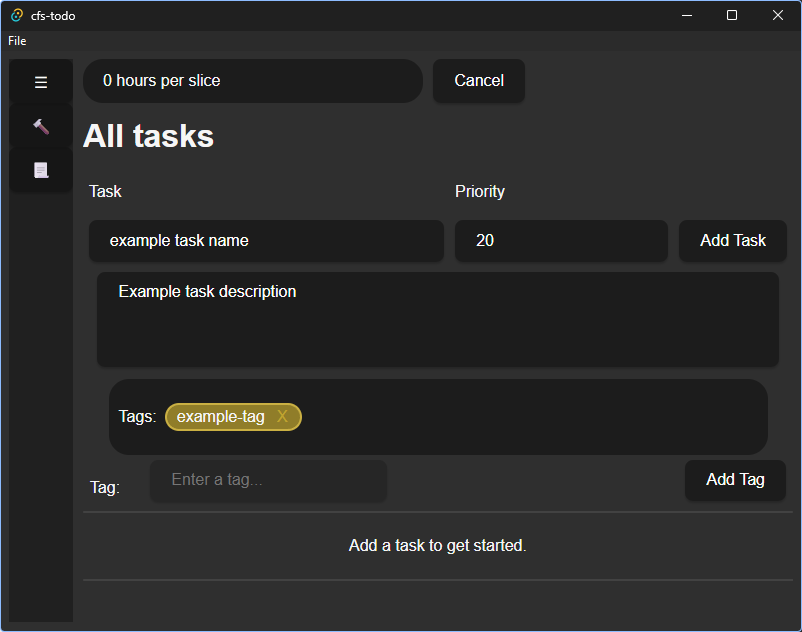  
*Task form with all fields filled out*

>[!warning]
> Putting spaces won't break the app but querying for spaces will **NOT** work properly. This is by design to filter the tags and will not be changed.

### Complete and Un-Complete a task

To complete or un-complete a task press on the checkmark button next to the task.

A completed task will show up as crossed out, and with a green checkmark in its button.
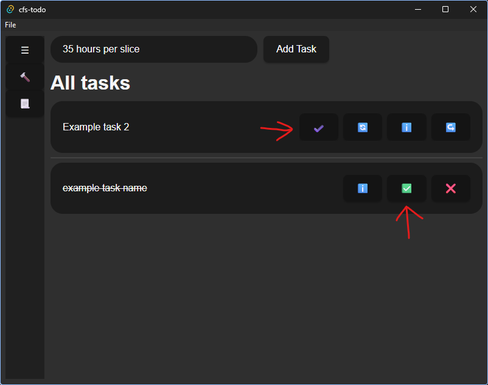  
*Example of completed and incomplete tasks*

>[!note]
>Tasks will show up until you close and reopen the app or if you [save](#saving) and refresh the app.  
>After any those two events the task will be deleted.

>[!caution]
>Deleted tasks cannot be recovered

### Rotate a task

If you reach the end of a time slice but you haven't finished, no worries!  
You can log your worked hours and rotate it. The app will give you the next task to work on and it will tell you what to work on next.

In a similar vein, if you cannot keep working on something because you're waiting for *that one email*. You can rotate it and [suspend it](#suspend-a-task).

To do so press on the 🔄️ button. Put your worked hours and press "Rotate task" or "Rotate and suspend" to rotate it or suspend it respectively.

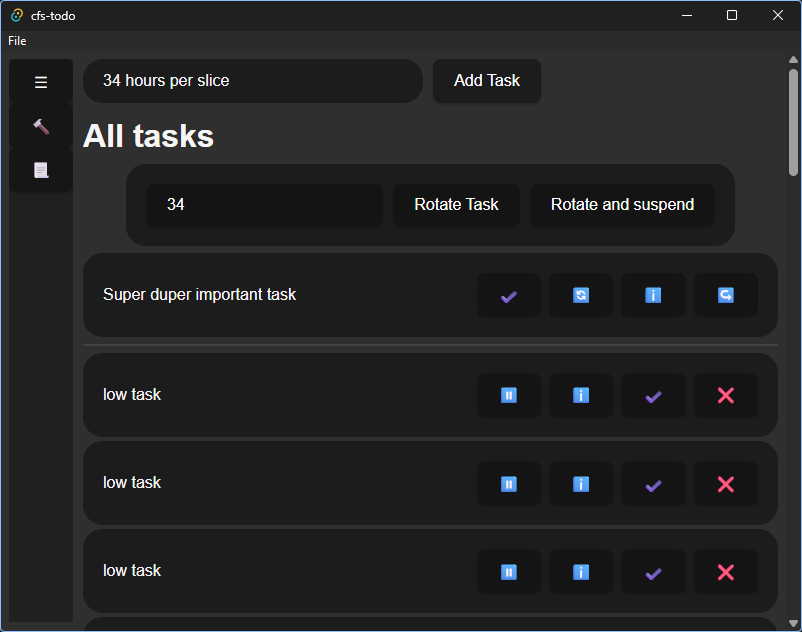  
*Task after pressing on 🔄️*

### Suspend a task

Sometimes you need to suspend a task without working on it. It happens!  
If you suspend a task without working on it, the system will add one hour of worked time. This is known as the "minimum rotation cost". This is set to 1 hr and, as with a lot of features, it will be configurable in the future.  
This is what keeps the app *Completely Failry Scheduled*. This feature makes it so that tasks that need costant waiting, don't interrupt tasks that need longer focus sessions even if the suspended task becomes available again in the middle of your current task.

To suspend a task press on the ⏸️ button on any inactive task. (red square 1 on the image)  
To suspend the current task press on the ↪️ button (red square 2) to show the secondary menu, and then press on ⏸️.

  
*Suspending an active or inactive task*

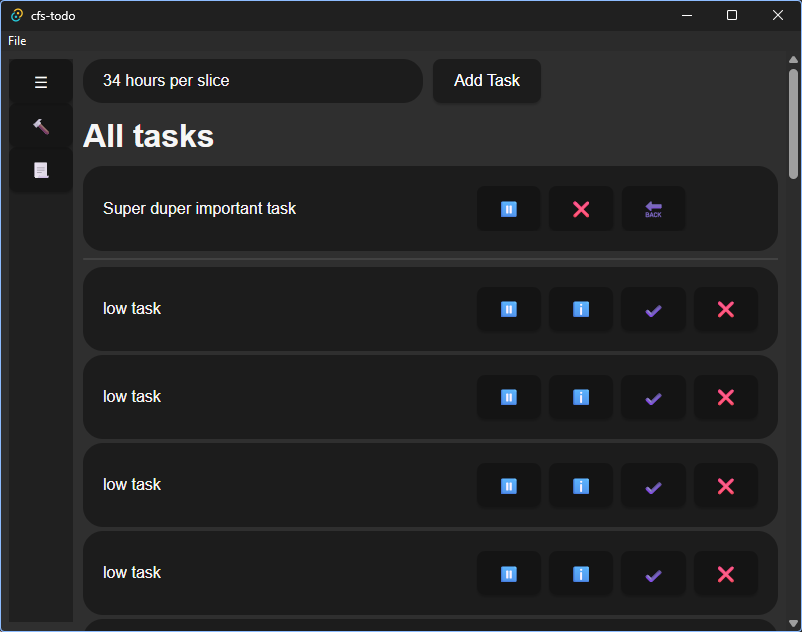  
*Secondary menu for active task*

### See a task detailed info

To see all the details about a task like the extended description, priority, tags of a task, etc.   Press on the ℹ️ button. This will pop out the information panel.

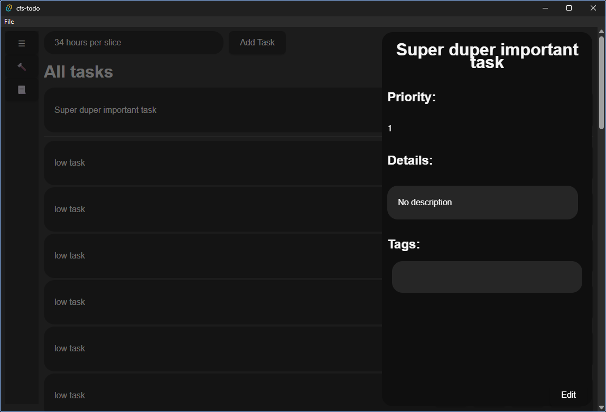  
*Info panel with the task info*

### Edit a task

[Open the info panel](#see-a-task-detailed-info) with the task and press the "Edit" button on the bottom and change any fields you would like to edit.  
Leaving the title empty will keep the original title, but after you save the title change is permanent and cannot be recovered.  

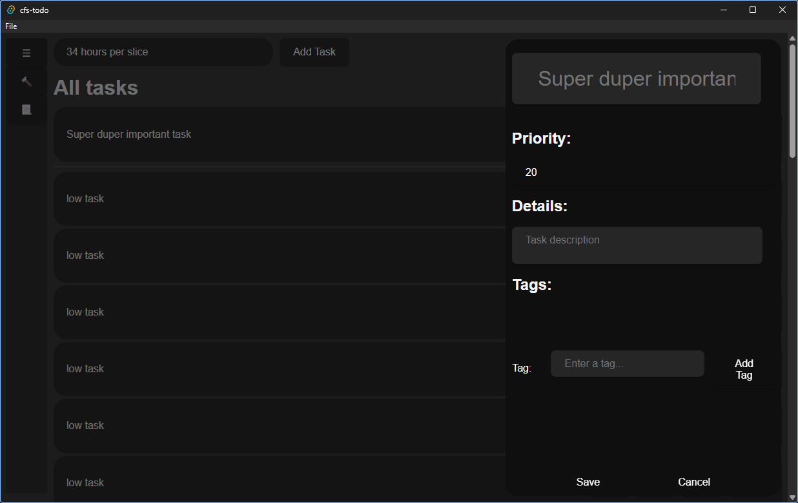  
*Info panel in edit mode*

> [!note]
> This panel can look a little funky if the app window is too small. We are working on it.

To save your changes press on "Save" on the bottom. Press "Cancel" or press outside of the edit panel to cancel the change.

> [!warning]
> As of writing this, all changes are irreversible. Please exercise caution editing.

### Delete a task

To delete a task press on the ❌ button next to it. The active task needs the secondary menu as in [supend a task](#suspend-a-task)

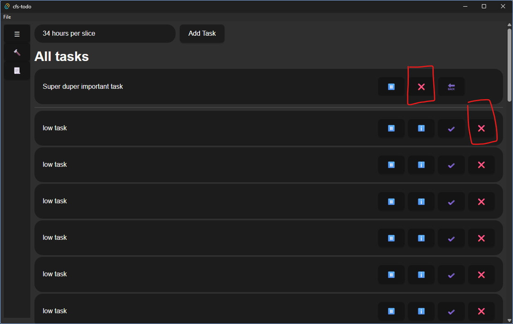  
*Delete buttons*

> [!important]
> Deleting a task is immediate. Tasks get saved on app close or when [saving manually](#saving).  
> We recommend that if you don't like a task, mark it as complete temporarily in case you change your mind.

## Workspaces

Workspaces are ways to clasify tasks so that tasks pertaining to specific projects don't mix with one another nor affect each others' work time and scheduling.

### Create a workspace

Press on the 🔨 button on the left sidebar to take you to the workspace builder.

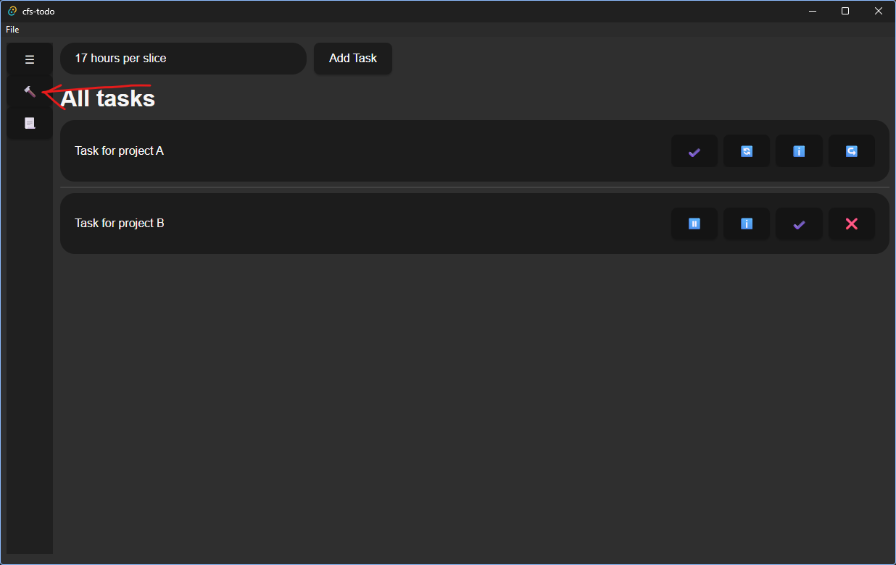  
*Location of the 🔨 button*

Fill out the name for the workspace. This can be anything but we recommend something that conveys what it is. Next press on "Add AND rule". We will explain what that means but for now you should get something like this.  

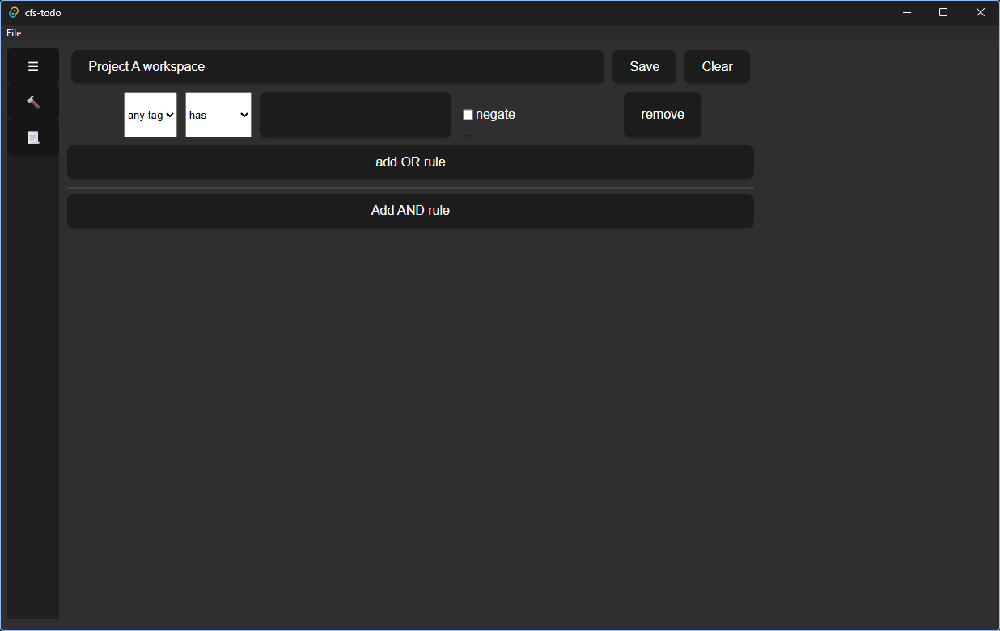
*Your workspace builder should look like this.*

To create a valid rule, you just need to add text to the text form. Everything will be saved at once when you click on "Save".  
If your rules got too noisy and want to start over, press on "Clear" to restart.  

#### Important rule concepts

Here is where we explain what all of this means. This list will try to be somewhat in the order that you would read things but some concepts might be grouped in a way that makes more sense.

**Rules:**  
Rules, as the name suggest, are rules (duh). They dictate whether a task will be shown when [opening a workspace](#open-a-workspace) and by extensions which tasks can affect each other while in that workspace. Rules only check the tasks tags. If a task has no tags, it will be rejected automatically.

> [!important]
> Remember how we said that [tags cannot have spaces](#create-a-task)? This is why.  
> Workspaces completely ignore whitespaces (space, tab, enter, etc.)  
> Right now that could make the app crash.  
> If you save a bad workspace you should be able to delete it from the app (just don't try to open it again) or from the workspaces.json file located in the %appdata%/com.daniel.cfs-todo folder.  
> We are working to fail more gracefully but for now please exercise caution.

> [!note] Note 1
> It just ocurred to me (danybeam) that workspaces could check the task name. I don't need it in my workflow, but if people show interest I would be more than happy to add it :)

> [!note] Note 2
> If you're tech savy enough to understand the parsing rules in the .g4 file in this repository, you can craft your own queries by editing the workspaces.json file directly.  
> Be warned that we don't have graceful error catching right now. The app might close on a bad query, or it might be ignored I (danybeam) honestly don't remember.  
> This is not an officially support scenario, therefore do it at your own risk.

**AND Rules:**  
This is a list of rules where **ALL** the rules, need to be followed for the task to show up in the workspace. If even one rule is not followed it the task will be discarded. AND rules are made out of 1 or more OR rules. AND rules cannot be empty.

**OR Rules:**
This is a relatively simple list of yes or no checks. As long as one of the OR rules is true, the whole list becomes true. Each list of OR rules contained within an AND rule are independent of each other so be mindful of contradictions like:  
`(any(has foo) or any(has somethingImpossible)) and (any(not has foo) or any(has somethingImpossible))`  
This will always be false (assuming somethingImpossible **is** impossible) because you're effectively comparing "do you both have and don't have foo?".

> [!note]
> The remove button only removes OR rules. To remove an AND rule you need to clear the workspace builder. This is known and is being worked on.

**any tag vs all tags:**
As the name suggest, this indicates whether one tag following the rule is enough to say that the rule is followed or whether all tags need to follow the rule to be valid.

e.g.:  
A task with the tags ["a","b","c"] will be picked by a rule like `any(has a)` but will be rejected by `all(has a)` because not every tag has the letter a in it.  
However a task with the tags ["a","ab","ca"] will be picked by both because all the tags have the letter a somewhere in them.

**has vs is vs startsWith:**  
They each represent a different way of checking the tags. This is what `any()` and `all()` "do".  

"**has**" means that the tag has your word(s) *somewhere* in it. It doesn't matter if it is at the begining, the middle, the end, 3rd from the left, etc. as long as it's there, you're good.  

"**is**" means that *the whole tag* matches your word(s). It **is** case insensitive so "is Foo" and "is foo" are effectively equivalent. (this is by design and non-negotiable)  

"**startsWith**" is pretty much what it sounds like. the tag needs to start with the word(s) you provide, but we don't care about the rest. e.g. both "foo" and "football" will match a "startsWith foo" rule. We try to not be prescriptive in this user manual but for transparency sake, this keyword was intended to group tasks that may have tags like "projectA/logisitics", "projectA/accounting", etc. but keep out something like "Evaluate project A" with the tag "QualityControl/projectA". Feel free to suggest other uses or do a change request to this document.

"**negate**" this means that you want the rule to **NOT** be followed. e.g. "not has foo" means that you don't want "foo" *anywhere* in the the tag. The negation affects only the rule, not the `any/all` part of the rule. See the following table to see how negate indirectly interacts with those

|         | any                                    | all                                    |
| ------- | -------------------------------------- | -------------------------------------- |
| normal  | at least one tag must follows the rule | all tags must follow the rule          |
| negated | at least one tag must break the rule   | no tags are allowed to follow the rule |

### Open a workspace

After you have [created a workspace](#create-a-workspace) you can open it by clickin on its button on the left sidebar.  

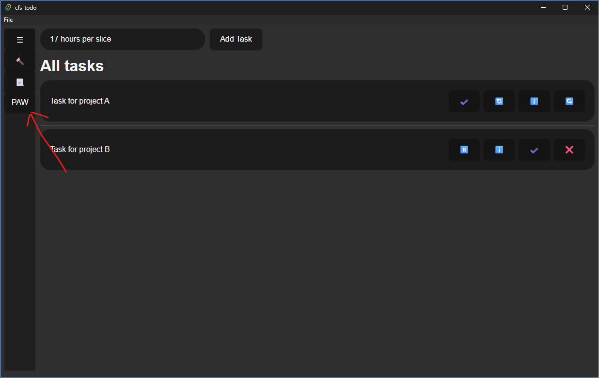  
*New button shows up in the sidebar*

After you press it, you should see the workspace with the name you gave it. You should also notice the little "filter" subtitle. This is a text representation of the filter you made while creating the workspace. If you have any issues with workspaces please make sure to include that in your report and at least one of each, a task that works and one that doesn't so we can try to replicate the issue on our side. (If you can share your tasks.json and your workspaces.json files that would be even better)
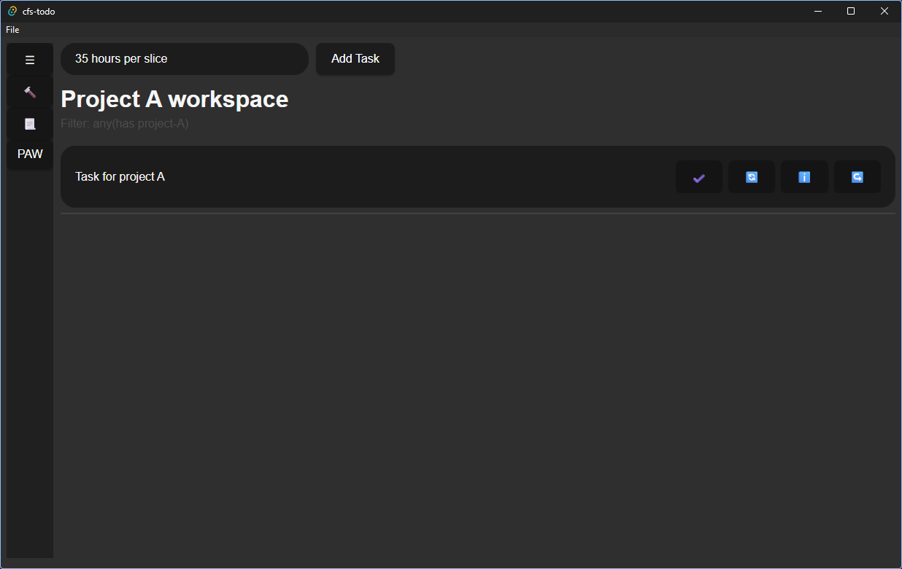  
*Recently created workspace*

**Something to note about workspaces**  
The sidebar can only show so many workspaces at a time. If you don't see your new workspace (or don't recognize the letters), press on the ☰ button to expand the sidebar and see both the workspaces' full name, and the scrollbar better to search for your workspace.

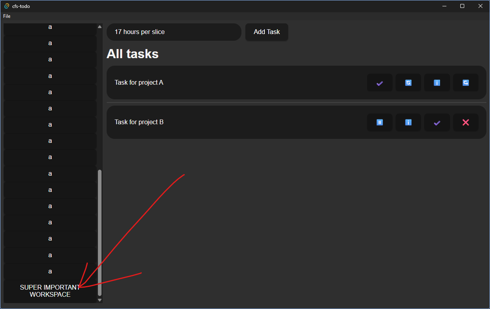  
*Notice the scrollbar bottomed out and how the important workspace is at the bottom*  

At this moment we don't intend to allow you to reorder the workspaces but if it's something you want let us know.

### Delete a workspace

To delete a workspace, first expand the left sidebar and press "Select workspaces for deletion".
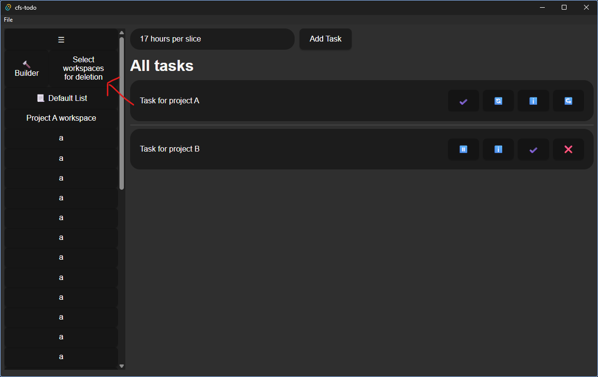  
*Location of the button*

Press on the workspaces you intend to delete. They will highlight to indicate they are selected. To unselect them just press on them again.  
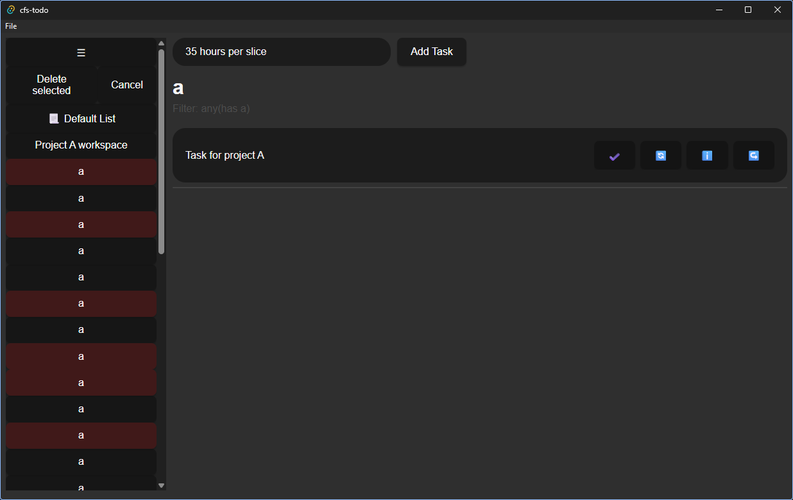  
*Workspaces selected*

To delete the selected workspaces press on the "Delete selected" button, to cancel press "Cancel". You will be prompted for confirmation. Press "Ok" to delete them or "Cancel" to go back.

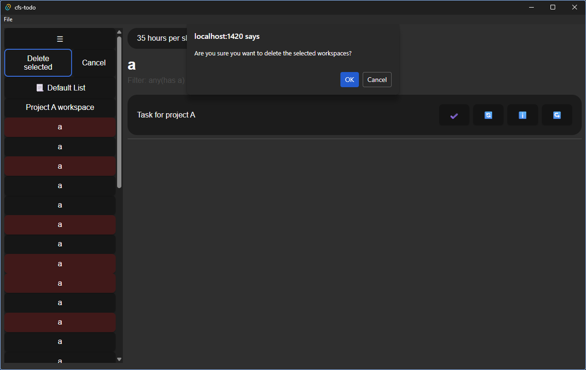
*Confirmation prompt before deletion*

> [!note] 
> If you had a deleted workspace open at the time of deletion, you will be sent to the "All tasks" view.  
> Otherwise you'll stay in whatever workspace was open.

## Saving

To save click on File > Save on the top menu, or press `Ctrl + S`  

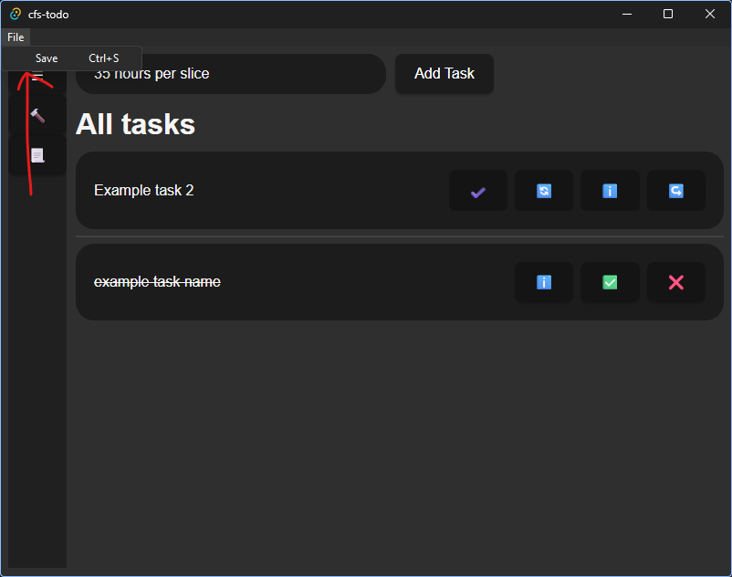  
*Location of the save menu*

# Technical Stuff

This app is made using Rust, and Typescript via the following frameworks/libraries:

- Tauri (both)
- SolidJS (TS)
- Specta (Rust)
- Antlr (Java but produces TS code)
- NPM + Node (JS, mostly for building and running debug builds)

# Known Issues

- You cannot delete AND rules in the workspace builder
- Overburden doesn't show until a task cannot be properly scheduled
- We don't have a proper configuration screen
- This program has not been tested with non-Windows machines
  - By extension, bundles have not been made for them. If there's enough demand we would be more than happy to make the effort
- Edit panel looks funky if the window is too small

# Roadmap

Under construction

# License

This software is distributed under the MIT license. Check the license file to know more.

THE SOFTWARE IS PROVIDED “AS IS”, WITHOUT WARRANTY OF ANY KIND, EXPRESS OR IMPLIED, INCLUDING BUT NOT LIMITED TO THE WARRANTIES OF MERCHANTABILITY, FITNESS FOR A PARTICULAR PURPOSE AND NONINFRINGEMENT. IN NO EVENT SHALL THE AUTHORS OR COPYRIGHT HOLDERS BE LIABLE FOR ANY CLAIM, DAMAGES OR OTHER LIABILITY, WHETHER IN AN ACTION OF CONTRACT, TORT OR OTHERWISE, ARISING FROM, OUT OF OR IN CONNECTION WITH THE SOFTWARE OR THE USE OR OTHER DEALINGS IN THE SOFTWARE.